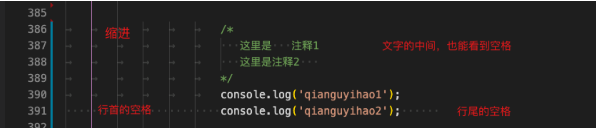
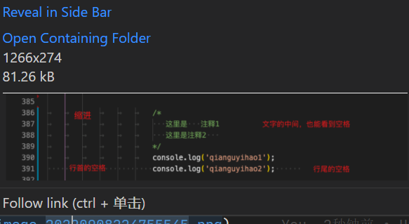
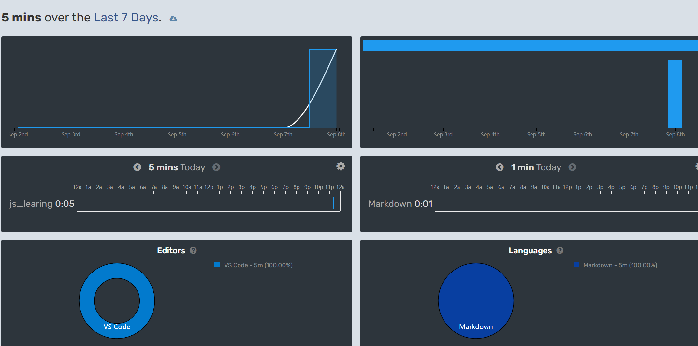
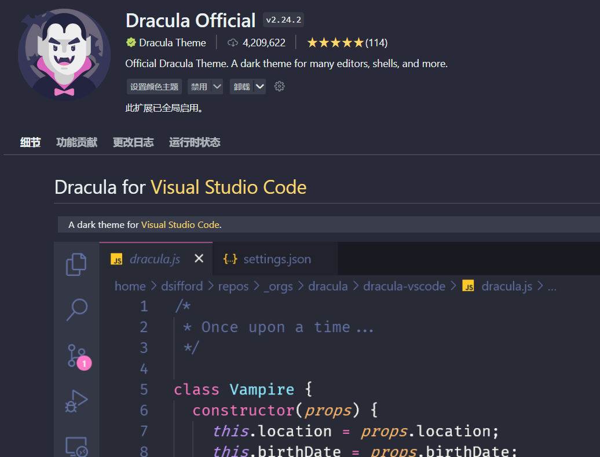

# js_learing

> 本项目是我用来记录我学习前端写的代码,比较基础

## vscode使用技巧

### IDE和编辑器的区别

**iDE**的全称是（Integrated Development Environment，集成开发环境）

比如说Eclipse

而我们的vscode则是一个编辑器

### vscode快捷键和配置

#### 直观地显示代码里的空格和缩进 ✨

代码里如果有缩进或者空格，肉眼是看不出来的，但是我们可以修改配置项，把它揪出来。

在配置项里搜索`editor.renderWhitespace`，修改为`all`：

效果:

### 并排编辑：左右（上下）显示多个编辑器窗口（copy代码利器）

> 并排编辑是所有的编辑操作中最常用的一个技巧，十分有用。比如我们在开发一个项目时，可能需要同时打开 HTML 文件和 CSS 文件，很常见。

Mac 用户按住快捷键 `Cmd + \`， Windows 用户按住快捷键`Ctrl + \`，即可同时打开多个编辑器窗口，进行并排编辑。效果如下：

#### Image Preview 【荐】

图片预览。鼠标移动到图片 url 上的时候，会自动显示图片的预览和图片尺寸

Markdown All in One
这个插件将帮助你更高效地在 Markdown 中编写文档

####  WakaTime 【荐】

统计在 VS Code 里写代码的时间.

效果是下面这种,感觉还行

#### Live Server 【荐】

在本地启动一个服务器，代码写完后可以实现「热更新」，实时地在网页中看到运行效果。就不需要每次都得手动刷新页面了。

使用方式：安装插件后，开始写代码；代码写完后，右键选择「Open with Live Server」

> 这个插件我早就安装了:smile:

皮肤

试了一下这个
